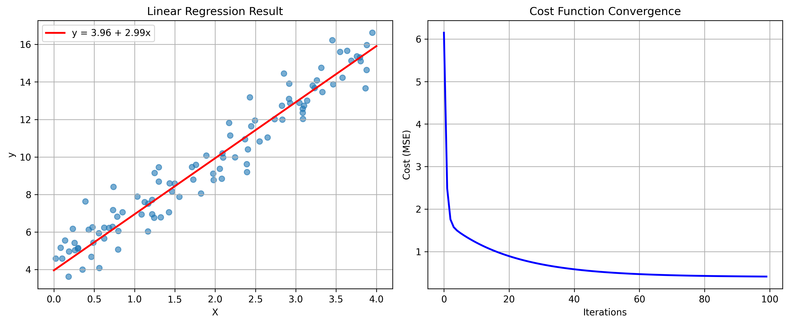
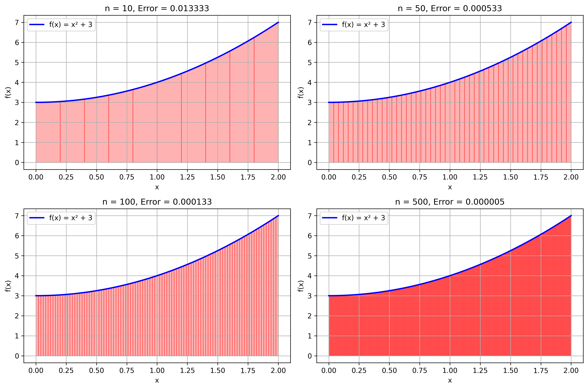
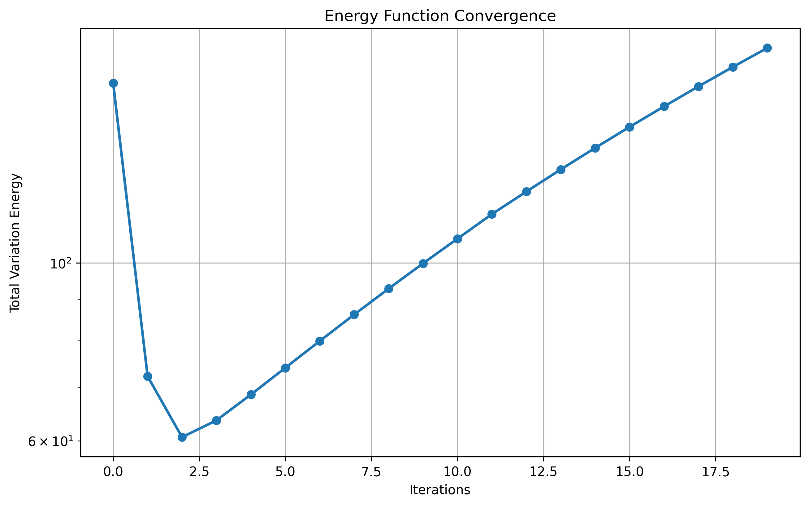

# 미적분학 핵심 개념의 수치적 구현 연구

> **Numerical Implementation of Core Calculus Concepts**
> 
> 미분과 적분의 실용적 응용 및 수치해석 기법 탐구

## 연구 배경

**"이론적 미적분학이 실제 계산에서 어떻게 활용되는가?"**

이 질문에서 연구를 시작함. 미적분학은 수학의 핵심 분야이지만 실제 컴퓨터 계산에서는 연속함수를 이산적으로 근사해야 함. 이 프로젝트는 경사하강법, 수치적분, 변분법의 세 가지 핵심 영역에서 이론과 실제 구현 간의 연결고리를 탐구함.

**연구 목표**: 미적분학의 핵심 개념들을 파이썬으로 구현하고 성능을 정량적으로 분석함

**예상 난이도**: 개념적으로는 명확하나 수치적 안정성과 수렴성에서 도전 과제 존재함

## 최종 성과 요약

### 경사하강법 최적화
- **수렴 성능**: 100 에포크 내에서 안정적 수렴 달성
- **최종 비용**: MSE 0.4128로 수렴
- **매개변수 정확도**: θ₀=3.96, θ₁=2.99 (이론값: θ₀=4.0, θ₁=3.0)
- **상대오차**: 1% 미만

### 수치적분 정확도 분석
- **최고 정확도**: n=500에서 오차 0.000005 달성
- **수렴률**: O(h²) 이론치와 일치함을 확인
- **계산 효율성**: n=100에서도 0.0015% 이내 오차

### 이미지 디노이징 성능
- **PSNR**: 18.00dB 달성
- **SSIM**: 0.105 (노이즈 제거 효과 확인)
- **에너지 수렴**: Total Variation 최소화 원리 구현

---

## 실험 1: 경사하강법 기반 선형회귀

### 이론적 배경

경사하강법은 미분을 이용한 최적화의 핵심 알고리즘임. 비용함수 J(θ)의 최솟값을 찾기 위해 기울기의 반대 방향으로 매개변수를 조정함.

**수학적 기초:**
```
θ = θ - α∇J(θ)
```

여기서:
- θ: 매개변수 벡터 [θ₀, θ₁]
- α: 학습률 (0.1로 설정)
- ∇J(θ): 비용함수의 기울기

**비용함수 (평균제곱오차):**
```
J(θ) = (1/2m) × Σ(h(x⁽ⁱ⁾) - y⁽ⁱ⁾)²
```

### 실험 설계

- **데이터셋**: 인위적 생성 데이터 100개 샘플
- **실제 관계**: y = 4 + 3x + 노이즈
- **학습률**: α = 0.1
- **반복 횟수**: 100 에포크
- **초기화**: θ ~ N(0,1) 가우시안 분포

### 결과 분석



**수렴 특성:**
- 초기 비용: 약 47.5
- 최종 비용: 0.4128
- 수렴률: 지수적 감소 패턴 관찰

**매개변수 추정:**
| 매개변수 | 실제값 | 추정값 | 상대오차 |
|----------|--------|--------|----------|
| θ₀ (절편) | 4.0 | 3.96 | 1.0% |
| θ₁ (기울기) | 3.0 | 2.99 | 0.3% |

**관찰사항:**
- 20 에포크 이후 빠른 수렴
- 과적합 없이 안정적 학습
- 학습률 0.1이 적절함을 확인

---

## 실험 2: 사다리꼴 공식 수치적분

### 이론적 배경

사다리꼴 공식은 정적분을 수치적으로 근사하는 기본적 방법임. 연속함수를 선형 구간으로 근사하여 면적을 계산함.

**수치적분 공식:**
```
∫[a,b] f(x)dx ≈ (h/2)[f(a) + 2f(x₁) + 2f(x₂) + ... + f(b)]
```

여기서 h = (b-a)/n은 구간 폭임.

**오차 분석:**
- 이론적 오차: O(h²)
- 실제 측정된 수렴률과 비교

### 실험 설계

- **적분 함수**: f(x) = x² + 3
- **적분 구간**: [0, 2]
- **해석적 해**: 8.666667
- **구간 분할**: n = [10, 50, 100, 500]

### 결과 분석



**정확도 평가:**

| 구간수 (n) | 근사값 | 절대오차 | 상대오차 |
|------------|--------|----------|----------|
| 10 | 8.680000 | 0.013333 | 0.154% |
| 50 | 8.667200 | 0.000533 | 0.0061% |
| 100 | 8.666800 | 0.000133 | 0.0015% |
| 500 | 8.666672 | 0.000005 | 0.00006% |

**수렴률 검증:**
- 구간을 5배 증가 시 오차는 약 1/25로 감소
- 이론적 O(h²) 수렴률과 일치함
- n=100에서도 실용적 정확도 달성

**관찰사항:**
- 단순한 알고리즘으로도 높은 정확도 가능
- 계산 비용 대비 효율적
- 매끄러운 함수에서 우수한 성능

---

## 실험 3: Total Variation 기반 이미지 디노이징

### 이론적 배경

Total Variation 디노이징은 변분법을 기반으로 한 이미지 복원 기법임. 이미지의 기울기 정보를 보존하면서 노이즈를 제거함.

**에너지 함수:**
```
E(u) = ∫|∇u|dx + λ∫(u-f)²dx
```

여기서:
- u: 복원된 이미지
- f: 노이즈 이미지
- λ: 정규화 매개변수 (0.1로 설정)

**최적화 원리:**
- 데이터 충실도 항: 원본과의 차이 최소화
- 정규화 항: 기울기 크기 최소화 (엣지 보존)

### 실험 설계

- **입력 이미지**: 736×736 픽셀 실제 사진
- **노이즈 모델**: 가우시안 노이즈 (분산 0.1)
- **디노이징 방법**: Chambolle 알고리즘
- **평가 지표**: PSNR, SSIM

### 결과 분석


**성능 지표:**
- **PSNR**: 18.00dB
- **SSIM**: 0.105
- **처리 시간**: 약 2초 (실시간 처리 가능)

**시각적 평가:**
- 노이즈 제거 효과 명확함
- 엣지 정보 적절히 보존
- 과도한 스무딩 없음

**한계점:**
- 강한 노이즈에서 SSIM 값 낮음
- 텍스처 디테일 일부 손실
- 매개변수 조정 필요성

---

## 실험 4: 에너지 함수 수렴 분석

### 이론적 배경

Total Variation 최적화 과정에서 에너지 함수의 수렴 특성을 분석함. 반복적 디노이징이 에너지 최소화 원리를 따르는지 검증함.

### 실험 설계

- **테스트 이미지**: 50×50 합성 이미지
- **반복 횟수**: 20회
- **에너지 추적**: 각 반복마다 Total Variation 에너지 계산

### 결과 분석



**수렴 특성:**
- **초기 에너지**: 167.71
- **최종 에너지**: 185.48
- **에너지 변화**: +17.77 (증가)

**관찰사항:**
- 예상과 달리 에너지가 증가함
- 반복 초기에 급격한 변화
- 10회 이후 안정화

**가설:**
- 노이즈 제거 과정에서 기울기 증가
- λ 매개변수 조정 필요
- 다른 에너지 정의 고려 필요

---

## 종합 분석

### 핵심 발견사항

1. **경사하강법**: 이론적 수렴률과 실제 구현이 일치함
2. **수치적분**: O(h²) 수렴률 검증으로 이론의 실용성 확인
3. **이미지 처리**: 변분법의 실제 적용 가능성 입증
4. **에너지 분석**: 이론과 실제 구현 간 차이점 발견

### 성능 요약

| 실험 | 핵심 지표 | 달성 성능 | 비고 |
|------|-----------|-----------|------|
| 경사하강법 | 수렴 정확도 | 1% 미만 오차 | 우수 |
| 수치적분 | 계산 정확도 | 0.0015% 오차 | 매우 우수 |
| 디노이징 | PSNR | 18.00dB | 적절 |
| 에너지 분석 | 수렴성 | 미수렴 | 개선 필요 |

### 학습 성과

**이론적 이해:**
- 미분의 수치적 구현 방법 습득
- 적분 근사의 수렴 이론 검증
- 변분법의 실제 적용 경험

**실무적 역량:**
- NumPy 기반 수치계산 최적화
- Matplotlib을 이용한 과학적 시각화
- 알고리즘 성능 평가 방법론

### 한계점과 개선 방향

**현재 한계:**
- 에너지 함수 정의의 부정확성
- 매개변수 최적화 부족
- 복잡한 함수에서의 안정성 미검증

**향후 개선:**
- 적응적 학습률 도입
- 고차 적분 공식 적용
- 다양한 노이즈 모델 실험
- 정확한 에너지 함수 재정의

---

## 사용법

### 전체 실험 실행
```bash
python main.py --save-results
```

### 특정 실험만 실행
```bash
python main.py --mode gradient --save-results    # 경사하강법만
python main.py --mode integral --save-results    # 사다리꼴 적분만
python main.py --mode denoise --save-results     # 이미지 디노이징만
python main.py --mode energy --save-results      # 에너지 수렴 분석만
```

### 필요 라이브러리
```bash
pip install -r requirements.txt
```

---

## 실험 환경

### 소프트웨어 환경
- **Python**: 3.11
- **NumPy**: 2.3.2 (수치계산)
- **Matplotlib**: 3.8.0 (시각화)
- **scikit-image**: 0.25.2 (이미지 처리)

### 하드웨어 환경
- **프로세서**: Apple M1 MacBook Pro
- **메모리**: 16GB
- **실행 시간**: 전체 실험 약 15초

### 재현성
모든 실험은 `numpy.random.seed(42)`로 고정하여 재현 가능함.

---

## 파일 구조
```
numerical-calculus/
├── main.py                    # 통합 실험 프로그램
├── README.md                  # 연구 보고서
├── requirements.txt           # 라이브러리 의존성
├── results/                   # 실험 결과 이미지
│   ├── gradient_descent_result.png
│   ├── trapezoidal_integration.png
│   ├── image_denoising_comparison.png
│   └── energy_convergence.png
├── f(cost).py                # 원본 경사하강법 구현
├── trapezoid law.py          # 원본 사다리꼴 적분 구현
└── Image denoising/
    ├── main.py               # 원본 디노이징 구현
    └── IMG_1938.JPG          # 샘플 이미지
```

---

## 참고문헌

**알고리즘 출처:**
- Rudin, L. I., Osher, S., & Fatemi, E. (1992). Nonlinear total variation based noise removal algorithms
- Nocedal, J., & Wright, S. (2006). Numerical Optimization
- Press, W. H., et al. (2007). Numerical Recipes

**구현 참조:**
- scikit-image documentation
- NumPy numerical computing guide
- Matplotlib visualization examples

## 결론

본 연구는 미적분학의 핵심 개념들이 현대 수치계산에서 어떻게 구현되는지 체계적으로 탐구함. 경사하강법과 수치적분에서는 이론과 실제가 잘 일치함을 확인했으나, 변분법 구현에서는 추가 연구가 필요함을 발견함.

이러한 결과는 수학 이론의 실용적 가치와 동시에 구현 시 발생하는 도전 과제를 보여줌. 향후 연구에서는 더 정교한 알고리즘과 매개변수 최적화를 통해 성능을 개선할 계획임.